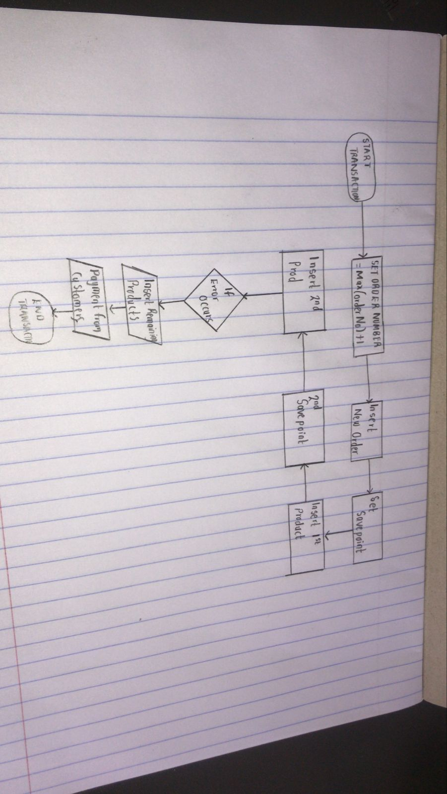

# BBT3104-Lab1of6-DatabaseTransactions

| **Key**                                                               | Value                                                                                                                                                                              |
|---------------|---------------------------------------------------------|
| **Group Name**                                                               | ? |
| **Semester Duration**                                                 | 19th August - 25th November 2024                                                                                                                       |

## Flowchart

## Pseudocode
BEGIN TRANSACTION

-- Step 1: Retrieve the latest order number
SET orderNumber = SELECT MAX(orderNumber) + 1 FROM orders;

-- Step 2: Insert a new order
INSERT INTO orders(orderNumber, orderDate, requiredDate, shippedDate, status, customerNumber)
VALUES (orderNumber, current_date, add_days(current_date, 3), add_days(current_date, 2), 'In Process', 145);

-- Step 3: Create SAVEPOINT before the first product
SAVEPOINT before_product_1;

-- Step 4: Insert the first product and update stock
INSERT INTO orderdetails(orderNumber, productCode, quantityOrdered, priceEach, orderLineNumber)
VALUES (orderNumber, 'S18_1749', 2724, 136, 1);

SET quantityInStock = SELECT quantityInStock FROM products WHERE productCode = 'S18_1749';
UPDATE products SET quantityInStock = quantityInStock - 2724 WHERE productCode = 'S18_1749';

-- Step 5: Create SAVEPOINT before the second product
SAVEPOINT before_product_2;

-- Step 6: Insert the second product
INSERT INTO orderdetails(orderNumber, productCode, quantityOrdered, priceEach, orderLineNumber)
VALUES (orderNumber, 'S18_2248', 540, 55.09, 2);

SET quantityInStock = SELECT quantityInStock FROM products WHERE productCode = 'S18_2248';
UPDATE products SET quantityInStock = quantityInStock - 540 WHERE productCode = 'S18_2248';

-- Step 7: Rollback if necessary
ROLLBACK TO SAVEPOINT before_product_2;

-- Step 8: Insert third product
INSERT INTO orderdetails(orderNumber, productCode, quantityOrdered, priceEach, orderLineNumber)
VALUES (orderNumber, 'S12_1099', 68, 95.34, 3);

SET quantityInStock = SELECT quantityInStock FROM products WHERE productCode = 'S12_1099';
UPDATE products SET quantityInStock = quantityInStock - 68 WHERE productCode = 'S12_1099';

-- Step 9: Receive payment
INSERT INTO payments(customerNumber, checkNumber, paymentDate, amount)
VALUES (145, 'JM555210', current_date, 300000);

-- Step 10: Commit the transaction
COMMIT TRANSACTION;

## Support for the Sales Departments' Report
 The design can be improved by introducing a payment schedule table that records multiple payments and their balances.

 Add a paymentStatus column in the orders table to track whether the payment is pending, partially paid, or fully paid.

Create a new table called paymentInstallments with the following fields:
installmentID (PK)
orderNumber (FK to orders)
paymentDate
amountPaid
balanceRemaining
dueDate (4 next installment)

With this design, each payment can be tracked individually, and the sales department can query this table to see which orders are partially paid and how much is still owed.